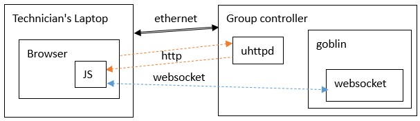

# VMS/ISLUS WebSocket Protocol

<link rel="stylesheet" type="text/css" href="auto-number-title.css" />

## Record Of Amendments

| Ver | Summary | Date | Approved |
| --- | --- | --- | --- |
| 0.1 | First issue | 1/3/2022 | Hailin |
| 0.1a | Add "replyms" | 6/6/2022 | Hailin |
| 0.1b | Update design | 4/7/2022 | Hailin |
| 0.1c | Change this doc to markdown | 19/7/2022 | Hailin |

---

- [VMS/ISLUS WebSocket Protocol](#vmsislus-websocket-protocol)
  - [Record Of Amendments](#record-of-amendments)
  - [Change Log](#change-log)
    - [Ver0.1](#ver01)
    - [Ver0.1a](#ver01a)
    - [Ver0.1b](#ver01b)
    - [Ver0.1c](#ver01c)
  - [Brief](#brief)
  - [Web Configuration](#web-configuration)
  - [Websocket Protocol](#websocket-protocol)
    - [Login](#login)
    - [GetGroupConfig](#getgroupconfig)
    - [SetGroupConfig](#setgroupconfig)
    - [GetStatus](#getstatus)
    - [ChangePassword](#changepassword)
    - [GetUserConfig](#getuserconfig)
    - [SetUserConfig](#setuserconfig)
    - [GetDimmingConfig](#getdimmingconfig)
    - [SetDimmingConfig](#setdimmingconfig)
    - [GetNetworkConfig](#getnetworkconfig)
    - [SetNetworkConfig](#setnetworkconfig)
    - [ControlDimming](#controldimming)
    - [ControlPower](#controlpower)
    - [ControlDevice](#controldevice)
    - [SystemReset](#systemreset)
    - [UpdateTime](#updatetime)
    - [GetFrameSetting](#getframesetting)
    - [GetStoredFrame](#getstoredframe)
    - [GetFrameCrc](#getframecrc)
    - [SetFrame](#setframe)
    - [DisplayFrame](#displayframe)
    - [GetMessageCrc](#getmessagecrc)
    - [GetStoredMessage](#getstoredmessage)
    - [SetMessage](#setmessage)
    - [DisplayMessage](#displaymessage)
    - [GetPlanCrc](#getplancrc)
    - [GetStoredPlan](#getstoredplan)
    - [SetPlan](#setplan)
    - [RetrieveLogs](#retrievelogs)
    - [ResetLogs](#resetlogs)
    - [SignTest](#signtest)
    - [DisplayAtomic](#displayatomic)
    - [Reboot](#reboot)

---

## Change Log

### Ver0.1

First issue

### Ver0.1a

1. CMD: System Reset, add group_id
2. CMD: SetDimming, add group_id
3. CMD "result" changed to string
4. Add CMD:
Dis/Enable Device
Power ON/OFF
Login
5. All replies with "replyms"

### Ver0.1b

Add commands that follows "GroupControllerWeb.drawio" design

### Ver0.1c

Change this doc to markdown.

---

## Brief

Group controller should provide web service to help technician test/diagnose VMS/ISULUS.

The "uhttpd" provides http service and "goblin" provides websocket service. In this document, "Master" stands for JavaScript program in browser (by http service) and "Controller" stands for websocket service in "goblin". Master talks to Controller by using JSON.

## Web Configuration

http port: 80

websocket port: 38401

websocket path: ws://0.0.0.0:38401/ws

## Websocket Protocol

There is a "replyms" (64-bit int) in all replies from controller to Master, which is the timestamp with ms at controller.

When Master sent a command to Controller, if the command is not a valid JSON, Controller would reply:

JSON:

```JSON
{
"replyms":13274693458,
"cmd":"Invalid JSON"
}
```

### Login

Direction: Master -> Controller
Description: This is the first command which master sent to controller. Other commands are not accepted until login is OK.
JSON:

```JSON
{
"cmd":"Login",
"user":"admin",
"password":"admin" // Max length is 10 letters
}
```

Controller reply:
JSON:

```JSON
{
"replyms":13274693458,
"cmd":"Login",
"user":"admin",
"result":"OK" or "Wrong password"
}
```

### GetGroupConfig

Direction: Master -> Controller
Description: Request the device controller to respond with its group setting.
JSON:

```JSON
{
"cmd":"GetGroupConfig"
}
```

Controller reply:
JSON:

```JSON
{
"replyms":13274693458,
"cmd":"GetGroupConfig"
"number_of_groups":3,
"groups":[
  {
  "group_id":1,
  "number_of_signs":1,
  "signs":[1]
  },
  {
  "group_id":2,
  "number_of_signs":3,
  "signs":[2,3,4]
  },
  {
  "group_id":3,
  "number_of_signs":2,
  "signs":[5,6]
  }
  ]
}
```

### SetGroupConfig

Direction: Master -> Controller
Description: Set group of signs.

**Because group configuration related to hardware (signs in same group should at same COM port).**

**SO changing group configuration should directly edit "config/UciProd" file.**

**Igonre this command. Controller reply "result":"Unspupported command".**

JSON:

```JSON
{
"cmd":"SetGroupConfig"
"number_of_groups":3,
"groups":[
  {
  "group_id":1,
  "number_of_signs":1,
  "signs":[1]
  },
  {
  "group_id":2,
  "number_of_signs":3,
  "signs":[2,3,4]
  },
  {
  "group_id":3,
  "number_of_signs":2,
  "signs":[5,6]
  }
  ]
}
```

Controller reply:
JSON:

```JSON
{
"replyms":13274693458,
"cmd":"SetGroupConfig"
"result": "OK" or error message
}
```

### GetStatus

Direction: Master -> Controller
Description: Master sends this command to Controller periodically to get Sign Status.
JSON:

```JSON
{
"cmd":"GetStatus"
}
```

Controller reply:
JSON:

```JSON
{
"replyms":13274693458,
"cmd":"GetStatus",
"manufacturer_code":"GC20020150",
"firmware":"0120",
"is_online":true,
"application_error":"0x00:No error",
"rtc":"31/12/2021 23:59:59",
"hardware_checksum":"0x55AA",
"controller_error":"0x00:No error",
"max_temperature":59,
"current_temperature":59,
"groups":[
  {
  "group_id":1,
  "deivce":"Enabled",
  "power":"On",
  },
  {
  "group_id":2,
  "deivce":"Enabled",
  "power":"On"
  },
  {
  "group_id":3,
  "deivce":"Enabled",
  "power":"On"
  }
  ],
"signs":[
  {
  "sign_id":1,
  "dimming_set":"auto"/"1-16",
  "dimming_level":1,
  "light_sensor":"error"/"9276",
  "frame_id":1,
  "message_id":10,
  "plan_id":2,
  "current_temperature":59,
  "max_temperature":59,
  "voltage":12000,
  "error_code":"0x00:No error",
  "faulty_pixels":2,
  "image":"Qk022AAAAAAAADYAAAAoAAAAIAEAAEAAAAAB……"
  },
  ……
  ]
}
```

### ChangePassword

Direction: Master -> Controller
Description: Change user password. Max length is 10 letters.
JSON:

```JSON
{
"cmd":"ChangePassword",
"user":"admin",
"current":"123456",
"new":"qwert"
}
```

Controller reply:
JSON:

```JSON
{
"replyms":13274693458,
"cmd":"ChangePassword",
"result":"OK" or error message
}
```

### GetUserConfig

Direction: Master -> Controller
Description: Get user configuration
JSON:

```JSON
{
"cmd":"GetUserConfig",
}
```

Controller reply:
JSON:

```JSON
{
"replyms":13274693458,
"cmd":"GetUserConfig",
"seed":"0xab",   // hex 0x00-0xFF
"password":"0x27ef", // hex 0x0000-0xFFFF
"device_id":1,
"broadcast_id":0,
"session_timeout":180,  // seconds
"display_timeout":3,  // minutes
"tmc_com_port":"Modem"/"COM1-6"
"baudrate":38400,  // 19200/38400/57600/115200
"multiled_fault":16, // 1-255
"tmc_tcp_port":38400,
"over_temp":65,  // 0-99
"locked_frame":2,  // 0-255
"city":"Sydney",
"last_frame_time":3, // 0-255
"locked_msg":2  // 0-255
}
```

### SetUserConfig

Direction: Master -> Controller
Description: Set user configuration
JSON:

```JSON
{
"cmd":"SetUserConfig",
"seed":"0xab",   // hex 0x00-0xFF
"password":"0x27ef", // hex 0x0000-0xFFFF
"device_id":1,   // 1-255
"broadcast_id":0,  // NOT same as device_id
"session_timeout":180,  // 0-65535 seconds
"display_timeout":3,  // 0-65535 minutes
"tmc_com_port":"Modem"/"COM1-6",
"baudrate":38400,  // 19200/38400/57600/115200
"multiled_fault":16, // 1-255
"tmc_tcp_port":38400,
"over_temp":65,  // 0-99
"locked_frame":2,  // 0-255
"city":"Sydney",
"last_frame_time":3, // 0-255
"locked_msg":2  // 0-255
}
```

Controller reply:
JSON:

```JSON
{
"replyms":13274693458,
"cmd":"SetUserConfig",
"result":"OK" or error message
}
```

### GetDimmingConfig

Direction: Master -> Controller
Description: Get dimmin configuration
JSON:

```JSON
{
"cmd":"GetDimmingConfig",
}
```

 Controller reply:
JSON:

```JSON
{
"replyms":13274693458,
"cmd":"GetDimmingConfig",
"night_level":1,   // 1-16, night<dawn/dusk<day
"dawn_dusk_level":8,
"day_level":16,
"night_max_lux":50,  // 1-9999, night < day < 18-hour
"day_min_lux":400,
"18_hours_min_lux":600
}
```

### SetDimmingConfig

Direction: Master -> Controller
Description: Set dimming configuration
JSON:

```JSON
{
"cmd":"SetDimmingConfig",
"night_level":1,   // 1-16, night<dawn/dusk<day
"dawn_dusk_level":8,
"daytime_level":16,
"night_max_lux":50,  // 1-9999, night < day < 18-hour
"daytime_min_lux":400,
"18_hours_min_lux":600
}
```

Controller reply:
JSON:

```JSON
{
"replyms":13274693458,
"cmd":"SetDimmingConfig",
"result":"OK" or error message
}
```

### GetNetworkConfig

Direction: Master -> Controller
Description: Get two ethernet cards' setting and NTP in controller.
JSON:

```JSON
{
"cmd":"GetNetworkConfig"
}
```

Controller reply:
JSON:

```JSON
{
"replyms":13274693458,
"cmd":"GetNetworkConfig",
"ETH2":
  {
    "proto":"dhcp",
    "dns":"1.1.1.1 8.8.8.8",
  },
  "ETH1":
  {
    "proto":"static",
    "ipaddr":"192.168.10.252",
    "netmask":"255.255.255.128",
    "dns":"1.1.1.1 8.8.8.8",
    "gateway":"192.168.10.251"
  },
  "NTP":
  {
    "server":"0.au.pool.ntp.org",
    "port":123
  }
}
```

### SetNetworkConfig

Direction: Master -> Controller
Description: The SET NETWORK command is used to set two ethernet cards and NTP in controller. Only one gateway is allowed.
JSON:

```JSON
{
"cmd":"SetNetworkConfig",
"ETH2":
  {
    "proto":"static",
    "ipaddr":"192.168.0.127",
    "netmask":"255.255.255.0",
    "dns":"1.1.1.1 8.8.8.8",
    "gateway":"192.168.10.251"
  },
  "ETH1":
  {
    "proto":"dhcp",
    "dns":"1.1.1.1 8.8.8.8"
  },
  "NTP":
  {
    "server":"192.168.10.252"/"pool.ntp.org",
    "port":123
  }
}
```

Controller reply:
JSON:

```JSON
{
"replyms":13274693458,
"cmd":" SetNetworkConfig",
"result": "OK" or error message
}
```

### ControlDimming

Direction: Master -> Controller
Description: Set controller dimming level
JSON:

```JSON
{
"cmd":"ControlDimming",
"groups":[0]/[1,2,3],
"setting":0 // Auto:0, 1-16
}
```

Controller reply:
JSON:

```JSON
{
"replyms":13274693458,
"cmd":"ControlDimming",
"result":"OK" or error message
}
```

### ControlPower

Direction: Master -> Controller
Description: Controller power ON/OFF
JSON:

```JSON
{
"cmd":"ControlPower",
"groups":[0]/[1,2,3],
"setting":0/1  //0:OFF, 1:ON
}
```

Controller reply:
JSON:

```JSON
{
"replyms":13274693458,
"cmd":"ControlPower",
"result":"OK" or error message
}
```

### ControlDevice

Direction: Master -> Controller
Description: Enable/disable device
JSON:

```JSON
{
"cmd":"ControlDevice",
"groups":[0]/[1,2,3],
"setting":0/1  // 0:disable, 1:enable
}
```

Controller reply:
JSON:

```JSON
{
"replyms":13274693458,
"cmd":"ControlDevice",
"result":"OK" or error message
}
```

### SystemReset

Direction: Master -> Controller
Description: The SYSTEM RESET command is used to reset the device controller.
JSON:

```JSON
{
"cmd":"SystemReset",
"group_id": 0, // group_id could be 0-max id, 0 for all group
"level":0 // could be 0, 1, 2, 3 and 255. Level 2,3,255 only for group_id=0
}
```

Controller reply:
JSON:

```JSON
{
"replyms":13274693458,
"cmd":"SystemReset",
"result":"OK" or error message
}
```

### UpdateTime

Direction: Master -> Controller
Description: The UPDATE TIME command is used to update the rtc in the device controller.
JSON:

```JSON
{
"cmd":"UpdateTime",
"rtc":"31/12/2021 23:59:59"
}
```

Controller reply:
JSON:

```JSON
{
"replyms":13274693458,
"cmd":"UpdateTime",
"result":"OK" or error message
}
```

### GetFrameSetting

Direction: Master -> Controller
Description: The Get Frame Setting command is used to get the setting from controller to initialise Set Frame Page.
JSON:

```JSON
{
"cmd":"GetFrameSetting"
}
```

Controller reply:
JSON:

```JSON
{
"replyms":13274693458,
"cmd":"GetFrameSetting",
"frame_type":["Text Frame", "Graphics Frame"/"HR Graphics Frame"],
"txt_frame_colours":["Default", "Red", "Yellow", "Green", "White", ……],
"gfx_frame_colours":["Default", "Red", "Yellow", ……,"Multi(4-bit)"],
"hrg_frame_colours":["Default", "Red", "Yellow", ……,"Multi(4-bit)", "RGB(24-bit)"],
"fonts":[0,1,2,3],
"txt_columns":[18,18,18,6],
"txt_rows":[3,3,3,1],
"conspicuity":["Off", "Up Down", "Left Right", "Wig Wag", "All Flash", "All On"],
"annulus":["Off", "Flashing", "On"]
}
```

Note:

1. "frame_type" can be ["Text Frame", "Graphics Frame", "HR Graphics Frame"].
2. If "Text Frame" is selected in "frame_type", the combobox of "Frame Colour" is sourced from "txt_frame_colours". And "gfx_frame_colours" for "Graphics Frame" and "hrg_frame_colours" for "HR Graphics Frame".
3. "fonts", "txt_columns" and "txt_rows" are binded. If fonts[1] is selected, txt_columns[1] and txt_rows[1] are in use.

### GetStoredFrame

Direction: Master -> Controller
Description: The Get Stored Frame command is used to request the frame data in controller. Frame image is Windows BMP format with no compression and 24-bit colour depth.
JSON:

```JSON
{
"cmd":"GetStoredFrame",
"id":1
}
```

 Controller reply:
JSON:

```JSON
{
"replyms":13274693458,
"cmd":"GetStoredFrame",
"id":1,
"revision":1,
"type":"Text Frame"/"Graphics Frame"/"HR Graphics Frame",
"colour":"Default "/"Red"/"Yellow"/"Green"/……/"Multi(4-bit)"/"RGB(24-bit)",
"font":0/1/2/3/4/5,
"conspicuity":"Off"/"Up Down"/"Left Right"/"Wig Wag"/"All Flash"/"All On",
"annulus":"Off"/"Flashing"/"On",
"text":"UNDEFINED", // if Text Frame, or
"image":"Qk022AAAAAAAADYAAAAoAAAAIAEAAEAAAAAB……" // if Gfx/Hrg
}
```

### GetFrameCrc

Direction: Master -> Controller
Description: The Get Frame Crc command is used to request all frames(0-255) crc in controller. Crc is 0-65535. If frame is undefined, CRC is -1. Crc of Frame[0] is always -1.
JSON:

```JSON
{
"cmd":"GetFrameCrc",
"id":1
}
```

 Controller reply:
JSON:

```JSON
{
"replyms":13274693458,
"cmd":"GetFrameCrc",
"crc":[-1,23555,3458,......,24750]
}
```

### SetFrame

Direction: Master -> Controller
Description: The Set Frame command is used to set the frame to controller.
JSON:

```JSON
{
"cmd":"SetFrame",
"id": 1,
"revision": 1,
"type":"Text Frame"/"Graphics Frame"/"HR Graphics Frame",
"colour":"Default "/"Red"/"Yellow"/"Green"/……/"Multiple"/"24-bit",
"font":0/1/2/3/4/5,
"conspicuity":"Off"/"Up Down"/"Left Right"/"Wig Wag"/"All Flash"/"All On",
"annulus":"Off"/"Flashing"/"On",
"text":"UNDEFINED", // if Text Frame, or
"image":"Qk022AAAAAAAADYAAAAoAAAAIAEAAEAAAAAB……" // if Gfx/Hrg
}
```

 Controller reply:
JSON:

```JSON
{
"replyms":13274693458,
"cmd":"SetFrame",
"result":"OK" or error message
}
```

### DisplayFrame

Direction: Master -> Controller
Description: The DisplayFrame command is used to display frame in a group.
JSON:

```JSON
{
"cmd":"DisplayFrame",
"group_id":1, // only one group
"frame_id":1
}
```

Controller reply:
JSON:

```JSON
{
"replyms":13274693458,
"cmd":"DisplayFrame",
"result":"OK" or error message
}
```

### GetMessageCrc

Direction: Master -> Controller
Description: The Get Message Crc command is used to request all messages(0-255) crc in controller. Crc is 0-65535. If message is undefined, CRC is -1. Crc of Message[0] is always -1.
JSON:

```JSON
{
"cmd":"GetMessageCrc",
"id":1
}
```

 Controller reply:
JSON:

```JSON
{
"replyms":13274693458,
"cmd":"GetMessageCrc",
"crc":[-1,23555,3458,......,24750]
}
```

### GetStoredMessage

Direction: Master -> Controller
Description: The Get Stored Message command is used to request the message data in controller.
JSON:

```JSON
{
"cmd":"GetStoredMessage",
"id":1
}
```

Controller reply:
JSON:

```JSON
{
"replyms":13274693458,
"cmd":"GetStoredMessage",
"id":1,
"result":"OK"/"Undefined",  // if result is undefined, there is no following data
"revision":1,
"transition":100,  //0.01 second
"entries":[
  {
  "id":1,
  "ontime":100
  },
  {
  "id":2,
  "ontime":100  // 0.1 second
  },
  …… // max 6 entries
  ]
}
```

### SetMessage

Direction: Master -> Controller
Description: The Set Message command is used to set message to controller.
JSON:

```JSON
{
"cmd":"SetMessage",
"id":1,
"revision":1,
"transition":100,  //0.01 second
"entries":[
  {
  "id":1,
  "ontime":100
  },
  {
  "id":2,
  "ontime":100  // 0.1 second
  },
  …… // max 6 entries
  ]
}
```

 Controller reply:
JSON:

```JSON
{
"replyms":13274693458,
"cmd":"SetMessage",
"result":"OK" or error message
}
```

### DisplayMessage

Direction: Master -> Controller
Description: The DisplayMessage command is used to display message in a group.
JSON:

```JSON
{
"cmd":"DisplayMessage",
"group_id":1, // only one group
"message_id":1
}
```

Controller reply:
JSON:

```JSON
{
"replyms":13274693458,
"cmd":"DisplayMessage",
"result":"OK" or error message
}
```

### GetPlanCrc

Direction: Master -> Controller
Description: The Get Plan Crc command is used to request all plans(0-255) crc in controller. Crc is 0-65535. If plan is undefined, CRC is -1. Crc of Plan[0] is always -1.
JSON:

```JSON
{
"cmd":"GetPlanCrc",
"id":1
}
```

 Controller reply:
JSON:

```JSON
{
"replyms":13274693458,
"cmd":"GetPlanCrc",
"crc":[-1,23555,3458,......,24750]
}
```

### GetStoredPlan

Direction: Master -> Controller
Description: The Get Stored Plan command is used to request the plan data in controller.
JSON:

```JSON
{
"cmd":"GetStoredPlan",
"id":1
}
```

Controller reply:
JSON:

```JSON
{
"replyms":13274693458,
"cmd":"GetStoredPlan",
"id":1,
"result":"OK"/"Undefined",  // if result is undefined, there is no following data
"revision":1,
"week":["Sun","Mon","Tue","Wed","Thu","Fri","Sat"],
"entries":[
  {
  "type":"frame"/"message",
  "id":1,
  "start":"0:00",
  "stop":"12:00"
  },
  {
  "type":"frame"/"message",
  "id":2,
  "start":"0:00",  // start time: hour:minute
  "stop":"12:00"  // stop time: hour:minute
  },
  …… // max 6 entries. Entry should not overlay others.
  ],
"enabled_group":[0]/[1,2,3]   // 0 means NO group is selected
}
```

### SetPlan

Direction: Master -> Controller
Description: The Set Plan command is used to set plan to controller.
JSON:

```JSON
{
"cmd":"SetPlan",
"id":1,
"revision":1,
"week":["Sun","Mon","Tue","Wed","Thu","Fri","Sat"],
"entries":[
  {
  "type":"frame"/"message",
  "id":1,
  "start":"0:00",
  "stop":"12:00"
  },
  {
  "type":"frame"/"message",
  "id":2,
  "start":"0:00",  // start time: hour:minute
  "stop":"12:00"  // stop time: hour:minute
  },
  …… // max 6 entries. Entry should not overlay others.
  ],
"enabled_group":[0]/[1,2,3]   // 0 means NO group is selected
}
```

Controller reply:
JSON:

```JSON
{
"replyms":13274693458,
"cmd":"SetPlan",
"result":"OK" or error message
}
```

### RetrieveLogs

Direction: Master -> Controller
Description: The RETRIEVE LOG command is used to retrieve the logs stored in the device controller's memory. There are 3 types of logs: Fault log (500 entries), Alarm log (500 entries) and Event log (1000 entries).
JSON:

```JSON
{
"cmd":"RetrieveFaultLog"/"RetrieveAlarmLog"/"RetrieveEventLog"
}
```

Controller reply:
JSON:

```JSON
{
"replyms":13274693458,
"cmd":"RetrieveFaultLog"/"RetrieveAlarmLog"/"RetrieveEventLog"
"number_of_entries":500, // depends
"logs":[
  {
  "id":0,
  "entry_no":276, // cycles between 0 and 65535
  "time":"12/32/2021 23:59:59",
  "code":"0x0E",  // Fault log only
  "event":"Onset",  // Fault log only
  "content":"Battery low" // less than 64-char
  },
  ……
  ]
}
```

### ResetLogs

Direction: Master -> Controller
Description: The RESET LOG command is used to reset the logs stored in the device controller's memory.
JSON:

```JSON
{
"cmd":"ResetFaultLog"/ "ResetAlarmLog"/"ResetEventLog"
}
```

Controller reply:
JSON:

```JSON
{
"replyms":13274693458,
"cmd":"ResetFaultLog"/ "ResetAlarmLog"/"ResetEventLog",
"result":"OK" or error message
}
```

### SignTest

Direction: Master -> Controller
Description: The SignTest command is used to display a test frame.
JSON:

```JSON
{
"cmd":"SignTest",
"group_id": 1, // only one group
"colour": "Red", // predefined colour
"pixels": "All pixels" // predefined
}
```

"colour" is selected from "GetFrameSetting" – "txt_frame_colours".

There are 5 predefined frames for "pixels":
All pixels / Odd rows / Even rows / Odd columns / Even columns
Controller will use frame_id:255 as current display. So, the "frame_id" in HeartbeatPoll will be 255 when displaying a test frame.

Controller reply:
JSON:

```JSON
{
"replyms":13274693458,
"cmd":"SignTest",
"result": "OK" or error message
}
```

### DisplayAtomic

Direction: Master -> Controller
Description: The DisplayAtomic command is used to display atomic frames in a group.
JSON:

```JSON
{
"cmd":"DisplayAtomic",
"group_id": 1, // only one group
"content":[
  {
  "sign_id":1,
  "frame_id":1
  },
  {
  "sign_id":2,
  "frame_id":2
  }
  ]
}
```

Controller reply:
JSON:

```JSON
{
"replyms":13274693458,
"cmd":"DisplayAtomic",
"result": "OK" or error message
}
```

### Reboot

Direction: Master -> Controller
Description: Tell the controller to reboot.
JSON:

```JSON
{
"cmd":"Reboot",
}
```

Controller reply:
JSON:

```JSON
{
"replyms":13274693458,
"cmd":"Reboot",
"result": "Controller will reboot after 5 seconds"
}
```
